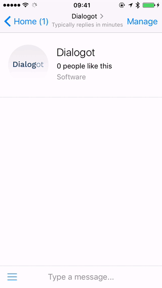

Messenger PHP
=============

## Installation

Use composer:

```bash
$ composer require mangoweb/messenger
```

## Usage



The `PAGE_ACCESS_TOKEN` must be Facebook Page `access_token` with `pages_messaging` permission. `RECIPIENT_ID` is different for each Facebook App, Page and User.

### Sending messages

```php
use Mangoweb\Messenger\Page;
use Mangoweb\Messenger\PageSender;
use Mangoweb\Messenger\Message;
use Mangoweb\Messenger\CardElement;
use Mangoweb\Messenger\Button;

$page = new Page(PAGE_ACCESS_TOKEN);
$sender = new PageSender($page);

// Sending simple text message
$textMessage = Message::text('Hello world!');
$sender->send(RECIPIENT_ID, $textMessage);

// Sending an image attachment
$imageMessage = Message::image('https://unsplash.it/400/300');
$sender->send(RECIPIENT_ID, $imageMessage);

// Sending complex message with two cards and some button
$cardButtons = [
	Button::url('Github', 'https://github.com/manGoweb/Messenger')
];

$cards = [
	CardElement::create('Lorem', 'ipsum dolor', 'https://github.com/manGoweb/Messenger', 'https://unsplash.it/400/300?random', $cardButtons),
	CardElement::create('Foo', NULL, NULL, 'https://unsplash.it/400/300?random')
];

$messageWithCards = Message::generic($cards);
$sender->send(RECIPIENT_ID, $messageWithCards);
```

### Thread management

```php
use Mangoweb\Messenger\Page;
use Mangoweb\Messenger\Greeting;
use Mangoweb\Messenger\GetStartedButton;
use Mangoweb\Messenger\PersistentMenu;
use Mangoweb\Messenger\Button;

$page = new Page(PAGE_ACCESS_TOKEN);

// Detect if page is already hooked to your Facebook App
echo ($page->isHookedToApp(APP_ID) ? 'already hooked' : 'not yet hooked') . "\n";

// Load basic info about a Page
$info = $page->loadInfo();
echo $info['name'] . "\n";

// Load info about user as the Page can see them
$profile = $page->loadProfile(RECIPIENT_ID);
echo $profile['first_name'] . ' ' . $profile['last_name'] . "\n";

// Set greeting text
$page->setGreeting(Greeting::text('Hello world'));

// Set "get started" button payload
$page->setGetStartedButton(GetStartedButton::payload('1'));

// Set persistent menu buttons
$page->setPersistentMenu(PersistentMenu::buttons([
	Button::postback('Help', 'help'),
	Button::postback('Sign in', 'sign-in'),
]));
```

### Receiving messages

```php
use Mangoweb\Messenger\Receiver;

$receiver = new Receiver();

// Define event hooks
$receiver->onMessage[] = function($message) {
	echo "Someone sent us a message" . "\n";
	var_dump($message);
};

$receiver->onPostback[]  = function($postback) {
	echo "Someone clicked on a postback button" . "\n";
	var_dump($postback);
};

// Load JSON payload from Messenger request
$httpBody = file_get_contents('php://input');
/*
$httpBody = '{
  "object":"page",
  "entry":[
    {
      "id":"PAGE_ID",
      "time":1458692752478,
      "messaging":[
        {
          "sender":{
            "id":"USER_ID"
          },
          "recipient":{
            "id":"PAGE_ID"
          },
          "timestamp":1458692752478,
          "message":{
            "mid":"mid.1458696618141:b4ef9d19ec21086067",
            "seq":51,
            "attachments":[
              {
                "type":"image",
                "payload":{
                  "url":"IMAGE_URL"
                }
              }
            ]
          }
        }
      ]
    }
  ]
}';
*/
$payload = json_decode($httpBody, TRUE);

// Process the payload
$receiver->processBody($payload);

```

## Tests

Add `tests/php.ini` (you may use the templates `php-unix.ini` or `php-win.ini`).

In `tests/local.php` you can define constants for testing real API calls (you may use the template `local.sample.php`)

```bash
$ ./vendor/bin/tester -c tests/php.ini tests
```

## License

MIT. See full [license](license.md).

